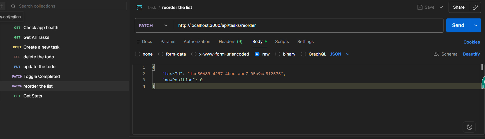

# Personal Task Manager

## Overview

This project is a full-stack Personal Task Manager application built as part of the Studio Graphene Full Stack Developer assessment.

The application allows users to create, view, update, complete, and delete tasks through a simple and responsive interface. Tasks can be filtered by status, searched by title, and persisted across server restarts using a JSON file as storage.

The project is built using Next.js as a full-stack framework, providing both frontend and backend functionality within a single application.

---

## Live Demo

**Application URL:** https://todo-studio-gl1f.onrender.com

---

## Features

### Core Features

* Create a new task
* View all tasks
* Edit existing tasks
* Delete tasks with confirmation
* Reorder the list hold and drag
* Mark tasks as complete/incomplete
* Filter tasks by:

  * All
  * Active
  * Completed

### Additional Features

* Search tasks by title
* Active and completed task statistics
* Overdue task highlighting
* Empty state when no tasks exist
* Persistent storage using JSON file
* Responsive design for desktop and mobile

---

## Tech Stack

### Frontend

* Next.js
* React
* TypeScript
* Tailwind CSS
* shadcn/ui

### Backend

* Next.js API Routes
* TypeScript

### Storage

* JSON File Storage

### Utilities

* React Hooks
* Native Fetch API
* UUID for task identifiers


## API Documentation

### Get All Tasks

```http
GET /api/tasks
```

Response

```json
[
  {
            "id": "cc237682-41ba-47a7-844f-acf7a4d636ab",
            "title": "Due testing-123",
            "description": "Ohh missed",
            "dueDate": "2026-06-01",
            "completed": false,
            "position": 2,
            "createdAt": "2026-06-05T12:01:55.127Z",
            "updatedAt": "2026-06-05T12:02:22.628Z"
  }
]
```

---

### Create Task

```http
POST /api/tasks
```

Request Body

```json
{
        "id": "b6b8aa77-0f75-4b66-bb21-0b7840d8bfc9",
        "title": "Learn ms-9",
        "description": "okay",
        "completed": false,
        "position": 3,
        "createdAt": "2026-06-05T12:14:16.007Z",
        "updatedAt": "2026-06-05T12:14:16.007Z"
}
```

---

### Update Task

```http
PUT /api/tasks/:id
```

Request Body

```json
{
        "id": "d3ae550f-34bb-4364-8b2c-070acd196320",
        "title": "updated -ms",
        "description": "okay",
        "completed": false,
        "position": 4,
        "createdAt": "2026-06-05T12:15:08.519Z",
        "updatedAt": "2026-06-05T12:15:19.172Z"
    }
```

---

### Toggle Task Status

```http
PATCH /api/tasks/:id/toggle
```

Request Body

```json
{
        "id": "d3ae550f-34bb-4364-8b2c-070acd196320",
        "title": "updated -ms",
        "description": "okay",
        "completed": true,
        "position": 4,
        "createdAt": "2026-06-05T12:15:08.519Z",
        "updatedAt": "2026-06-05T12:16:50.051Z"
}
```

---

### Delete Task

```http
DELETE /api/tasks/:id
```

Response

```json
{
  "message": "Task deleted successfully"
}
```

---

## How to Run Locally

### Clone Repository

```bash
git clone <repository-url>
```

### Navigate to Project

```bash
cd project-name
```

### Install Dependencies

```bash
npm install
```

### Run Development Server

```bash
npm run dev
```

### Open Browser

```text
http://localhost:3000
```

---

## Data Persistence

Tasks are stored inside:

```text
/src/data/tasks.json
```

The application reads from and writes to this file through the backend APIs, allowing tasks to persist across application restarts.

---

## Design Decisions

### Why Next.js?

I chose Next.js because it provides both frontend and backend capabilities in a single framework, simplifying development and deployment while still maintaining a clear separation between UI components and API routes.

### Why JSON File Storage?

The assessment explicitly allowed JSON file storage. Using a JSON file keeps the application lightweight while demonstrating CRUD operations and data persistence without introducing unnecessary database complexity.

### Why TypeScript?

TypeScript improves maintainability, provides better developer experience, and helps prevent runtime errors through static typing.

---

## Future Improvements

Given more time, I would implement:

* PostgresSQL database using Prisma
* Unit and integration tests
* Task categories and priorities
* Pagination for large task lists
* Dark mode support
* User authentication
* Docker support
* CI/CD pipeline
* Improve the UI from user's perspective

---

## Known Limitations

* JSON file storage is not suitable for high-concurrency production environments.
* Drag-and-drop functionality was not implemented.
* Automated tests were not included due to time constraints.

---

## AI Usage Disclosure

AI tools were used to assist with brainstorming, code review, and implementation guidance. All code submitted was reviewed, understood, and modified where necessary by me.

---

## Author

Lakshman Singh

Studio Graphene Full Stack Developer Assessment